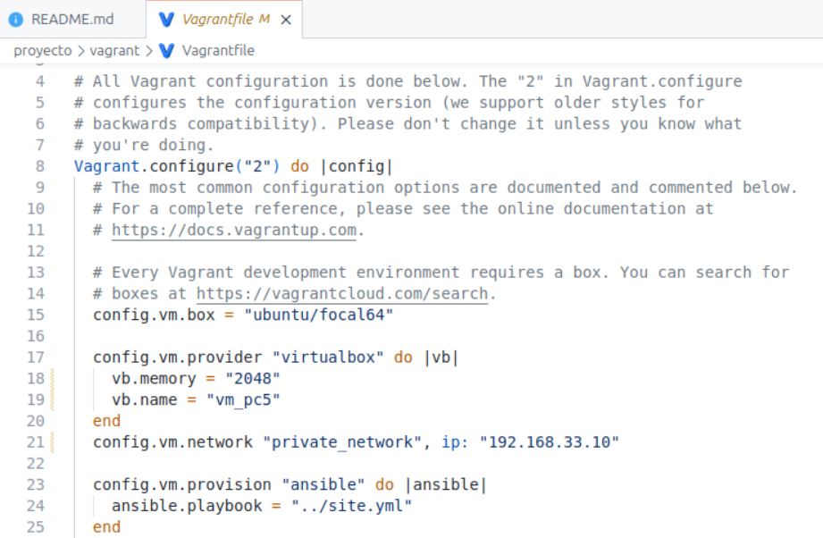

# Practica Calificada 5

**Nombre:** Daniela Cadena Villanueva

**email:** daniela.cadena.v@uni.pe

-----
## Ejercicio 1: Configuración básica del sistema

En el ejecicio 1 debemos de:
- Configurar la maquina virtual y agregar las tareas de crear usuarios y grupos
- Actualizar los paquetes del SO
- Crear un usuario y asignarlo a un grupo

Primero configuramos nuestro archivo Vagrantfile:

1. Crear el archivo dentro de `vagrant/` ejecutamos:

```bash
vagrant init ubuntu/focal64
``` 
2. configuramos nuestro archivo `Vagrantfile`


3. Configuramos nuestro playbook `site.yml`

```yaml
---
- name: Aprovisionador de ansible para configurar la VM
  hosts: all
  become: yes
  become_method: sudo
  remote_user: vagrant
  tasks:
    - import_tasks: ansible/ejercicio1/main.yml
```

4. Configuramos las tareas en `ansible/ejercicio1/main.yml`


5. En VirtualBox observamos que la máquina esta corriendo


6. Nos conectamos a nuestra máquina remota mediante ssh con `vagrant ssh` y comprobamos que se creo el usuario devuser con `id devuser`


----

## Ejercicio 2: Implementación de servicion web con seguridad básica

