# Practica Calificada 5

**Nombre:** Daniela Cadena Villanueva

**email:** daniela.cadena.v@uni.pe

-----
## Ejercicio 1: Configuración básica del sistema

En el ejecicio 1 debemos de:
- Configurar la maquina virtual y agregar las tareas de crear usuarios y grupos
- Actualizar los paquetes del SO
- Crear un usuario y asignarlo a un grupo

Primero configuramos nuestro archivo Vagrantfile:

### 1. Crear el archivo dentro de `vagrant/` ejecutamos:

```bash
vagrant init ubuntu/focal64
``` 
### 2. configuramos nuestro archivo `Vagrantfile`


### 3. Configuramos nuestro playbook `site.yml`

```yaml
---
- name: Aprovisionador de ansible para configurar la VM
  hosts: all
  become: yes
  become_method: sudo
  remote_user: vagrant
  tasks:
    - import_tasks: ansible/ejercicio1/main.yml
```

### 4. Configuramos las tareas en `ansible/ejercicio1/main.yml`


### 5. En VirtualBox observamos que la máquina esta corriendo


### 6. Nos conectamos a nuestra máquina remota mediante ssh con `vagrant ssh` y comprobamos que se creo el usuario devuser con `id devuser`


También comprobamos que están presentes las demás configuraciones que se realizaron con las tareas


----

## Ejercicio 2: Implementación de servicion web con seguridad básica

### 1. Actualizamos nuestro playbook.yml `site.yml` según los requerimientos del ejercicio:
```yaml
---
- name: Aprovisionador de ansible para configurar la VM
  hosts: all
  become: yes
  become_method: sudo
  remote_user: vagrant
  tasks:
    - import_tasks: ansible/ejercicio1/main.yml
    - import_tasks: ansible/ejercicio2/main.yml
  handlers:
    - include_tasks: handlers/main.yml
```

### 2. Creamos las tareas:
 - Instalar Nginx
 - Generar certificados SSL autofirmados
 - Configuración de Nginx para utilizarlo con SSL
 - Habilita y configurar UFW para permitir tráfico en los puertos necesarios

```yaml
---
- name: Instalar nginx
  apt: 
    name: nginx
    state: latest
    update_cache: yes

- name: Instalar OpenSSL
  apt:
    name: openssl
    state: present
    update_cache: yes

- name: Crear directorio para certificados SSL
  file:
    path: /etc/ssl/certs
    state: directory
    mode: '0755'

- name: Generar clave privada
  community.crypto.openssl_privatekey:
    path: /etc/ssl/private/mi_certificado.key
    size: 2048

- name: Generar certificado SSL autofirmado
  community.crypto.x509_certificate:
    path: /etc/ssl/certs/mi_certificado.crt
    privatekey_path: /etc/ssl/private/mi_certificado.key
    provider: selfsigned

- name: Configurar Nginx para usar con SSL
  ansible.builtin.template:
    src: templates/nginx_ssl.conf.j2
    dest: /etc/nginx/sites-available/default
    mode: '0644'
  notify:
    - Reiniciar Nginx

- name: Habilitar y configurar el firewall UFW 
  ufw:
    state: enabled
    policy: allow

- name: Permitir tráfico en los puertos necesarios
  ufw:
    rule: allow
    port: "22,80,443" # SSH, HTTP, HTTPS
    proto: tcp
```

### 3. Creamos el manejador en `handlers/main.yml` 
```yaml
---
- name: Reiniciar Nginx
  ansible.builtin.service:
    name: nginx
    state: restarted
```

### 4. Creamos la platilla que nos permite configurar Nginx para usar los certificados SSL y servidores HTTPS

**Bloque para el Servidor HTTPS**

```nginx
server {
    listen 443 ssl;
    listen [::]:443 ssl;
    server_name localhost;

    ssl_certificate /etc/nginx/ssl/nginx-selfsigned.crt;
    ssl_certificate_key /etc/nginx/ssl/nginx-selfsigned.key;

    ssl_protocols TLSv1.2 TLSv1.3;
    ssl_ciphers HIGH:!aNULL:!MD5;

    location / {
        root /var/www/html;
        index index.html;
    }
}
```

El primer bloque nos permite configurar el puerto 443 para el servidor HTTPS también se especifican las rutas donde se esncuentra el certificado SSL (`/etc/nginx/ssl/nginx-selfsigned.crt`) y la clave privada (`/etc/nginx/ssl/nginx-selfsigned.key`).

La línea `ssl_protocols TLSv1.2 TLSv1.3` define los protocolos TLS que son permitidos y la línea `ssl_ciphers HIGH:!aNULL:!MD5` define las cifras criptográficas que permiten las conexiones seguras. 


**Bloque para el Servidor HTTP**

```nginx
server {
    listen 80;
    listen [::]:80;
    server_name localhost;
    return 301 https://$host$request_uri;
}
```

El servido va a escuchar en el puerto 80, definimos el nombre del servidor como `localhost` por úiltimo `return 301 https://$host$request_uri` se encarga de redirigir las solicitudes HTTP a la versón de HTTPS.


### 5. Actualizamos nuestra VM con las nuevas configuraciones


### 6. Ingresamos a nuestra vm mediante `vagrant ssh` y comprobamos el estado de nuestras tareas:

### Objetivos esperados:

- Verificamos el estado de Nginx


- Verificamos que Nginx está escuchando en los puertos configurados y tambien el estado del Firewall


- Verificamos la prueba de HTTP y su redireccionamiento


---
 **Nota**
- Para la configuración de generación de certificados autofirmados consulté en [la siguiente página](https://docs.ansible.com/ansible/latest/collections/community/crypto/docsite/guide_selfsigned.html)
- Revisé [la siguiente pagina](https://docs.ansible.com/ansible/latest/playbook_guide/playbooks_handlers.html) para configurar los handlers

----

## Ejercicio 3: Despliegue de una palicación web con balanceador de carga

### 1. Actualizamos nuestro playbook.yml `site.yml` según los requerimientos del ejercicio:
```yaml
---
- name: Aprovisionador de ansible para configurar la VM
  hosts: all
  become: yes
  become_method: sudo
  remote_user: vagrant
  tasks:
    - import_tasks: ansible/ejercicio1/main.yml
    - import_tasks: ansible/ejercicio2/main.yml
    - import_tasks: ansible/ejercicio3/main.yml
  handlers:
    - include_tasks: handlers/main.yml
```

### 2. Creamos las tareas:
 - Instalar dependencias de Python.

 ```yaml
- name: Instalar dependencias de Python
  apt: 
    name: python3-pip
    state: latest
    update_cache: yes
```

 -  Instalar Flask y Gunicorn. 

 ```yaml
- name: Instalar Flask y Gunicorn
  pip:
    name:
      - flask
      - gunicorn
```


 - Crear directorio y copiar la aplicación Flask. 
 - Habilita y configurar UFW para permitir tráfico en los puertos necesarios.

 ```yaml
- name: Crear directorios para la app Flask
  ansible.builtin.file:
    path: /etc/www/flask_app_{{ flask_port }}
    state: directory
    mode: '0755'
  loop:
    - 4000
    - 4001
    - 4002
  loop_control:
    loop_var: flask_port

- name: Copiar la aplicación Flask
  ansible.builtin.template:
    src: templates/flask_app.py.j2
    dest: /etc/www/flask_app_{{ flask_port }}/app.py
    mode: '0644'
  loop:
    - 4000
    - 4001
    - 4002
  loop_control:
    loop_var: flask_port
```


 - Crear servicios systemd para cada instancia de la aplicación en puertos diferentes. 

```yaml
 - name: Crear servicios systemd para cada instancia
  ansible.builtin.template:
    src: templates/flask_app@.service.j2
    dest: /etc/systemd/system/flask_app@{{ flask_port }}.service
  loop:
    - 4000
    - 4001
    - 4002
  loop_control:
    loop_var: flask_port
```

- Iniciar y habilitar los servicios de la aplicación. 

```yaml
- name: Recargar el modulo de systemd para aplicar los cambios
  ansible.builtin.systemd:
    daemon_reload: yes

- name: Iniciar y habilitar los servicios de la app
  ansible.builtin.systemd:
    name: "flask_app@{{ flask_port }}.service"
    state: started
    enabled: yes
  loop:
    - 4000
    - 4001
    - 4002
  loop_control:
    loop_var: flask_port
```


- Configurar Nginx como balanceador de carga. 

```yaml
- name: Configurar Nginx como balanceador de carga
  ansible.builtin.template:
    src: templates/nginx_load_balance.conf.j2
    dest: /etc/nginx/sites-available/default
    mode: '0644'
```

### 3. Creamos las plantillas: 
  - `flask_app.py.j2` : para la aplicación Flask
  - `flask_app@.service.j2` : para los archivos de servicio systemd. 
  - `nginx_load_balance.conf.j2` : para la configuración de Nginx para balanceo de carga. 

### 4. Actualizamos la máquina virtual con los cambios implementados para que se ejecuten las nuevas tareas:


### 5. Verficamos que los servicios creados en las tareas estén disponibles en la máquina remota.


- Primero listamos las dependencias, Flask y Gunicorn para ver si se instalaron correctamente


- Listamos los directorios creados para las instancias de la aplicacion Flask


- Observamos el contenido de los archivos instanciados


- Listamos los servicios creados y su contenido
 


### Objetivos esperados:

- Verificamos el estado de los servicios


- Verificamos la configuración de Nginx como balanceador de carga y su estado.

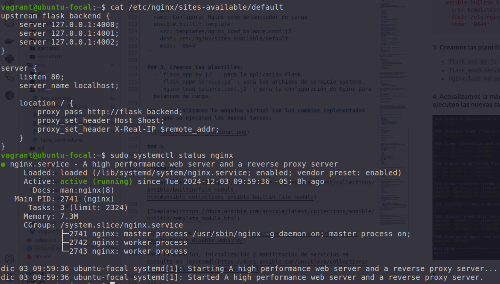

- Probamos cada instancia en cada puerto


- Ejecutamos `curl http://localhost` para un verificar un correcto balanceop de cargas, ya que no se especifica el puerto.


Como podemos observar en la imagen en 3 ejecuciones observamos que se alternan los puertos por lo que se comprueba que Nginx está balanceando correctamente las solicitudes.

**Nota:**

Consulté en las siguientes p+aginas para:

[Crear directorio](https://docs.ansible.com/ansible/latest/collections/ansible/builtin/file_module.html#ansible-collections-ansible-builtin-file-module)

[Template](https://docs.ansible.com/ansible/latest/collections/ansible/builtin/template_module.html)

[Configuracion del directorio](https://www.linode.com/docs/guides/how-to-enable-disable-website/)

Para la creacion, inicialización y habilitación de servicios se consulto en [Systemd](https://docs.ansible.com/ansible/5/collections/ansible/builtin/systemd_module.html)

----

## Ejercicio 4: Monitoreo y alertas

En este ejercicio debemos: 

- Instalar y configurar Prometheus y Grafana. 
- Configurar alertas básicas en Prometheus. 
- Integrar métricas de la aplicación Flask. 

### 1. Actualizamos nuestro playbook `site.yml`

```yaml
---
- name: Aprovisionador de ansible para configurar la VM
  hosts: all
  become: yes
  become_method: sudo
  remote_user: vagrant
  tasks:
    - import_tasks: ansible/ejercicio1/main.yml
    - import_tasks: ansible/ejercicio2/main.yml
    - import_tasks: ansible/ejercicio3/main.yml
    - import_tasks: ansible/ejercicio4/main.yml
  handlers:
    - import_tasks: handlers/main.yml
```

### 2. Se crean las tareas en `ansible/ejercicio4/main.yml`, las tareas son:

- Instalar Prometheus y configurar su servicio

```yaml
- name: Descargar binarios de Prometheus desde GitHub
  ansible.builtin.get_url:
    url: "https://github.com/prometheus/prometheus/releases/download/v2.44.0/prometheus-2.44.0.linux-amd64.tar.gz"
    dest: /tmp/prometheus.tar.gz

- name: Extraer Prometheus
  ansible.builtin.unarchive:
    src: /tmp/prometheus.tar.gz
    dest: /etc/prometheus
    remote_src: yes

- name: Crear servicio para Prometheus
  ansible.builtin.copy:
    src: templates/prometheus.service.j2
    dest: /etc/systemd/system/prometheus.service          
  notify:
    - Reiniciar prometheus
```

- Instalar Node Exporter.  

```yaml
- name: Descargar binarios de Node Exporter desde GitHub
  ansible.builtin.get_url:
    url: "https://github.com/prometheus/node_exporter/releases/download/v1.8.2/node_exporter-1.8.2.linux-amd64.tar.gz"
    dest: /tmp/node_exporter.tar.gz

- name: Extraer Node Exporter
  ansible.builtin.unarchive:
    src: /tmp/node_exporter.tar.gz
    dest: /etc/node_exporter
    remote_src: yes

- name: Crear servicio para Node Exporter
  ansible.builtin.copy:
    src: templates/node_exporter.service.j2
    dest: /etc/systemd/system/node_exporter.service

- name: Iniciar Node Exporter
  ansible.builtin.systemd:
    name: node_exporter
    state: started
    enabled: yes
```

- Instalar Grafana y configurar su servicio. 

```yaml
- name: Agregar clave GPG de Grafana
  apt_key:
    url: "https://packages.grafana.com/gpg.key"
    state: present

- name: Agregar repositorio de Grafana
  apt_repository:
    repo: "deb https://packages.grafana.com/oss/deb stable main"
    state: present

- name: Actualizar la caché de paquetes
  apt:
    update_cache: yes

- name: Instalar Grafana
  apt:
    name: grafana
    state: present
```

- Configurar alertas en Prometheus. 

```yaml
- name: Configurar alertas en Prometheus
  ansible.builtin.copy:
    src: templates/alert.rules.j2
    dest: /etc/prometheus/alert.rules
  notify:
    - Reiniciar prometheus
```


### 3. Creamos un manejador para reiniciar Prometheus:

```yaml
- name: Reiniciar prometheus
  ansible.builtin.service:
    name: prometheus
    state: restarted
```

### 4. Creamos las plantillas:

- `prometheus.yml.j2` : Se encarga de la comnfiguración básica de Pometheus nos dice que endpoint se deben de monitorear y el tiempo de espera para la recolección de las métricas.  

- `prometheus.service.yml.j2` : Se encarga de definir el servicio systemd para Prometheus, especifica las variables de entorno, los archivos de configuración.

- `node_exporter.service.yml.j2` : Define el servicio systemd para Node Exporter, que es una herramienta para recolectar métricas del sistema, como el uso de CPU, memoria, disco, etc.

- `alert.rules.j2` : Define las condiciones bajo las cuales Prometheus enviará alertas. Por ejemplo, si el uso de la CPU supera cierto límite configurado o determinado o si una métrica de Flask no está respondiendo correctamente.

### 5. Actualizamos la máquina virtual con los cambios implementados para que se ejecuten las nuevas tareas:

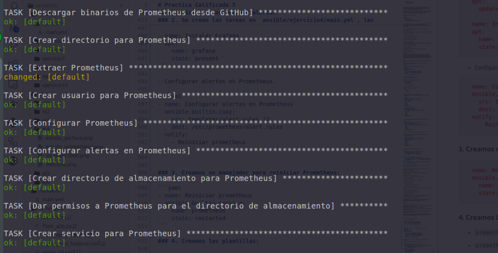

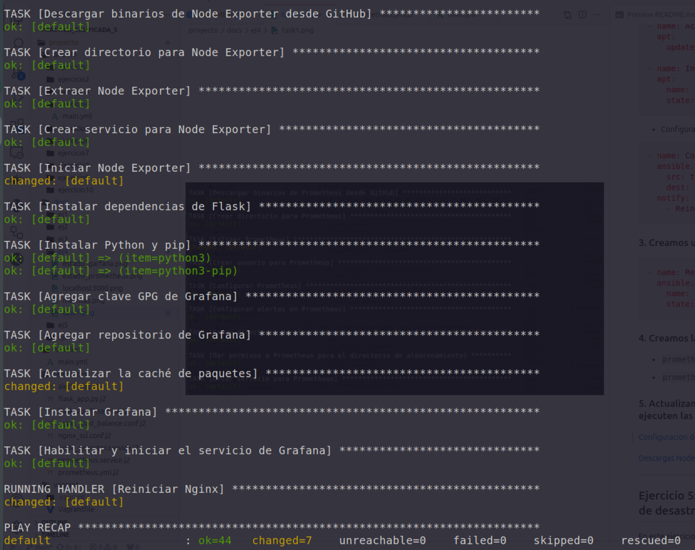

### 6. Objetivos esperados

- Verificamos el estado de prometheus

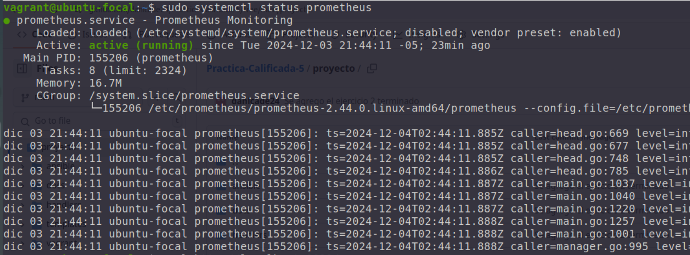

- Accedemos al servidor de Prometheus para ver las metricas

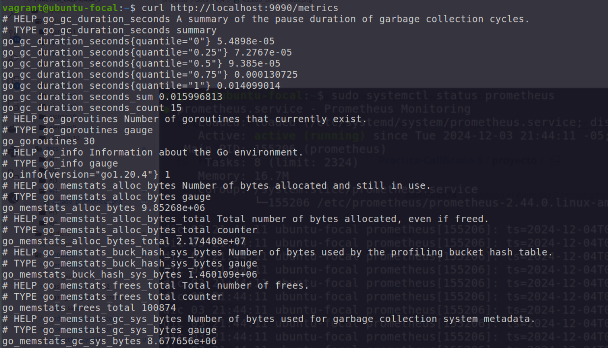

- Verificamos el estado de grafana

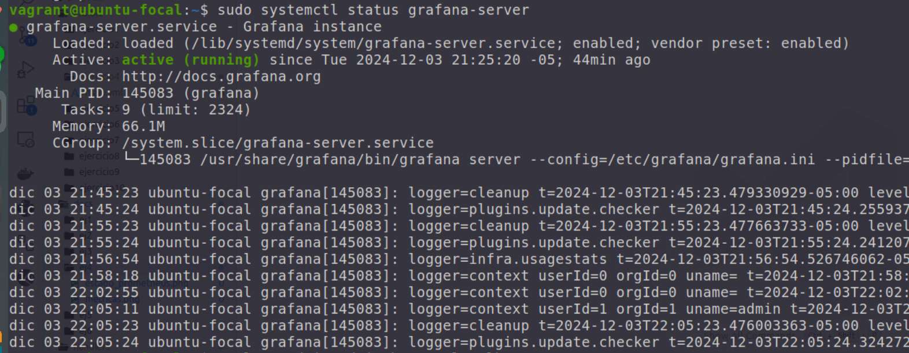

- Accedemos al servidor de grafana 

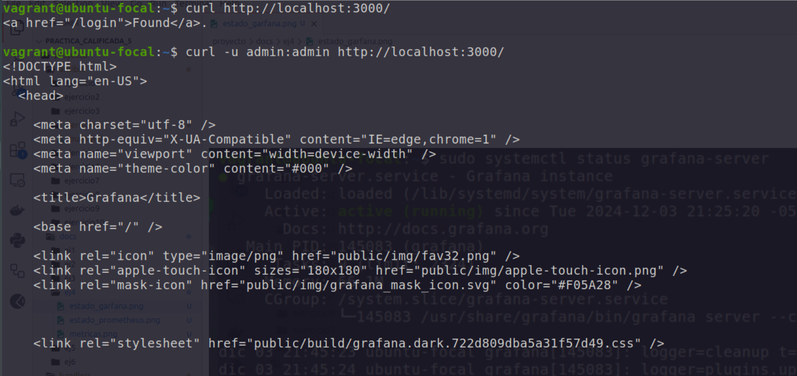

Como no tenemos interfaz no podemos acceder directamente pero nos logueamos con el comando `curl -u admin:admin http://localhost:3000/
`


### Acceder a través del navegador 

Ejecutamos el siguiente comando para conocer la direccion ipv4 asociada a nuestra máquina host y poder conectarnos con esa ip a los puertos de prometheus, grafana, node exporter y de la app.

```bash
hostname -I
```
Nos muestra una slaida como esta: 
```
10.0.2.15 192.168.33.10 fd00::a5:dcff:fe83:3a0f 
```

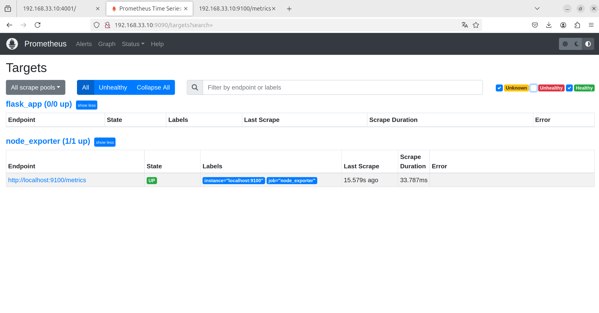

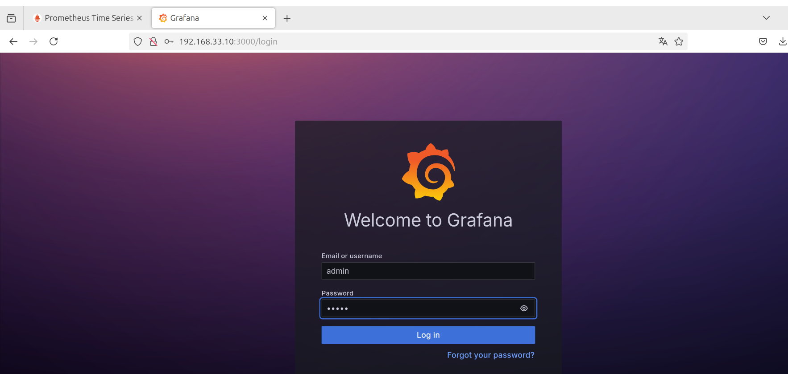

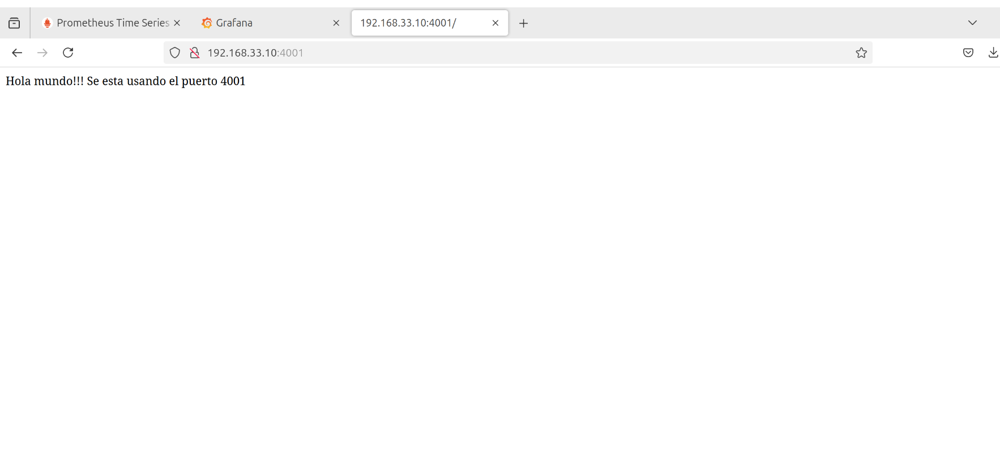

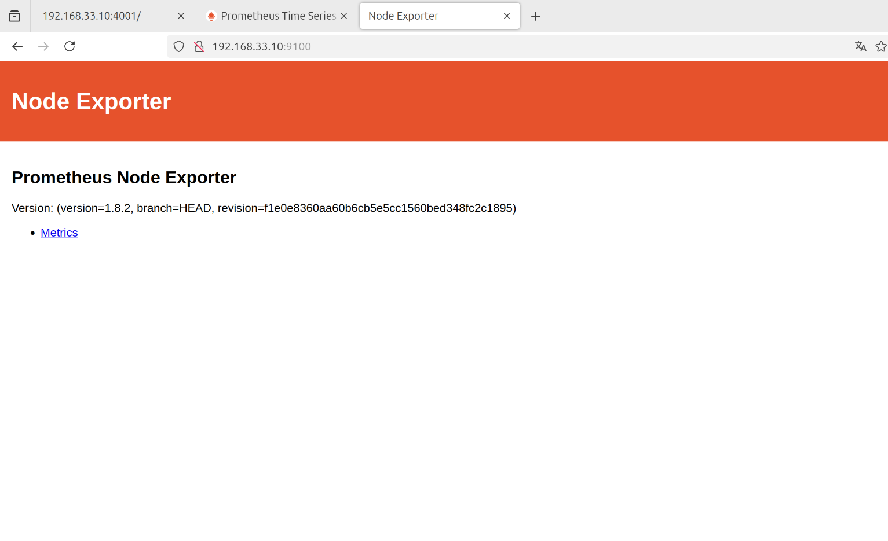

### Observamos las métricas de Node Exporter

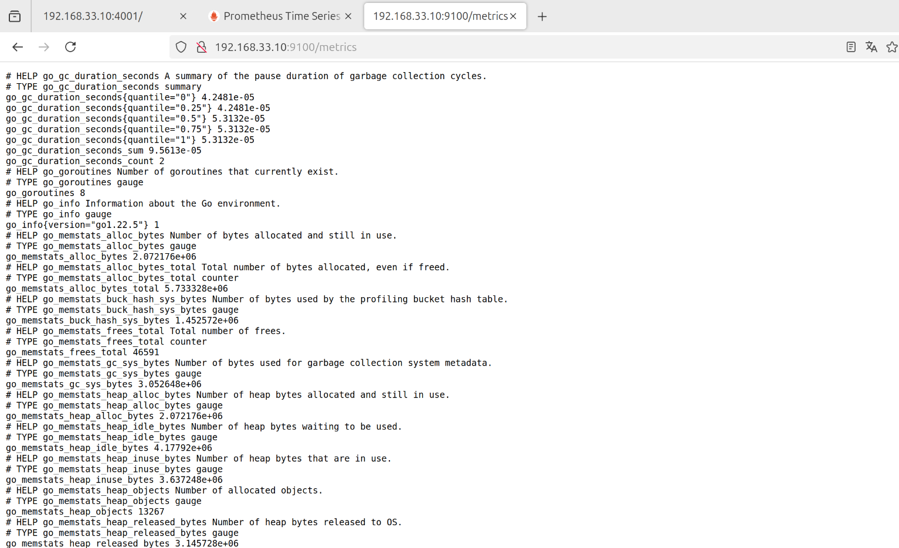


### Dashboards generados por Grafana

Para generar las gráficas configuramos Prometheus pero con la dirección de nuestro servidor que es `http://192.168.33.10:9090` 
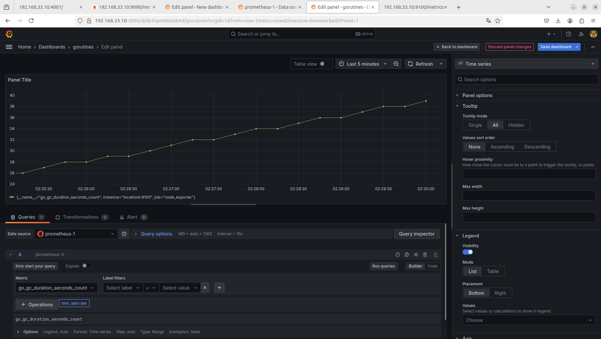

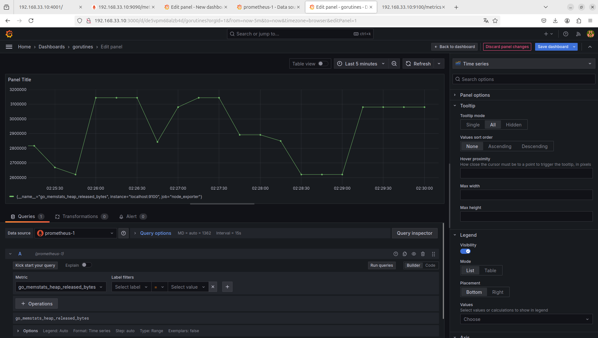

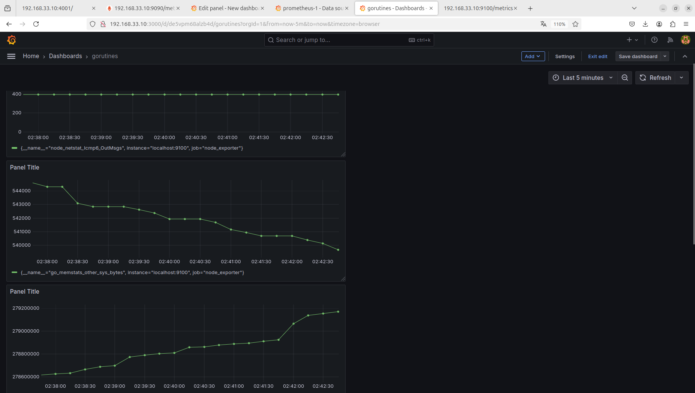

[Configuracion de Prometheus con Ansible](https://prometheus-community.github.io/ansible/branch/main/prometheus_role.html#entry-point-main-installs-and-configures-prometheus)

[Descargas Node Exporter](https://github.com/prometheus/node_exporter/releases)

[Guia para la instalacion de prometheus y grafana](https://medium.com/devops4me/install-grafana-prometheus-node-exporter-using-ansible-1771e649a4b3)

---

## Ejercicio 5: Implementación de alta disponibilidad y recuperación de desastres

En este ejercicio debemos: 

----

## Ejercicio 6: Seguridad avanzada y cumplimiento 

En este ejercicio debemos: 

-----